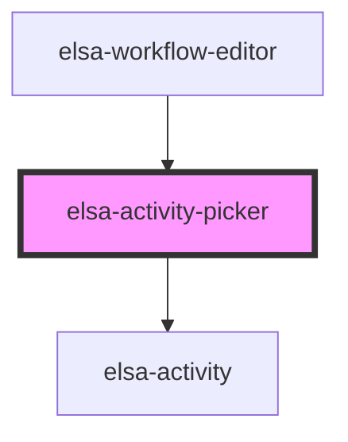

# elsa-activity-picker

<!-- Auto Generated Below -->

## Properties

| Property | Attribute | Description | Type    | Default     |
| -------- | --------- | ----------- | ------- | ----------- |
| `graph`  | --        |             | `Graph` | `undefined` |

## Events

| Event                  | Description | Type                                          |
| ---------------------- | ----------- | --------------------------------------------- |
| `expandedStateChanged` |             | `CustomEvent<ActivityPickerStateChangedArgs>` |

## Dependencies

### Used by

 - [elsa-workflow-editor](../elsa-workflow-editor)

### Depends on

- [elsa-activity](../elsa-activity)

### Graph

----------------------------------------------

*Built with [StencilJS](https://stenciljs.com/)*
