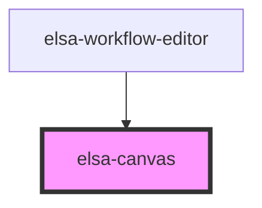

# elsa-canvas

<!-- Auto Generated Below -->

## Methods

### `getGraph() => Promise<Graph>`

#### Returns

Type: `Promise<Graph>`

### `resize(width?: number, height?: number) => Promise<void>`

#### Returns

Type: `Promise<void>`

### `updateLayout() => Promise<void>`

#### Returns

Type: `Promise<void>`

## Dependencies

### Used by

 - [elsa-workflow-editor](../elsa-workflow-editor)

### Graph

----------------------------------------------

*Built with [StencilJS](https://stenciljs.com/)*
