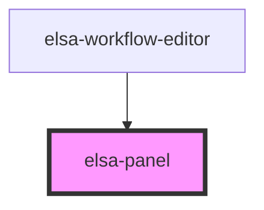

# elsa-panel

<!-- Auto Generated Below -->

## Properties

| Property | Attribute | Description | Type     | Default |
| -------- | --------- | ----------- | -------- | ------- |
| `size`   | `size`    |             | `number` | `300`   |

## Events

| Event                  | Description | Type                                 |
| ---------------------- | ----------- | ------------------------------------ |
| `expandedStateChanged` |             | `CustomEvent<PanelStateChangedArgs>` |

## Dependencies

### Used by

 - [elsa-workflow-editor](../elsa-workflow-editor)

### Graph

----------------------------------------------

*Built with [StencilJS](https://stenciljs.com/)*
